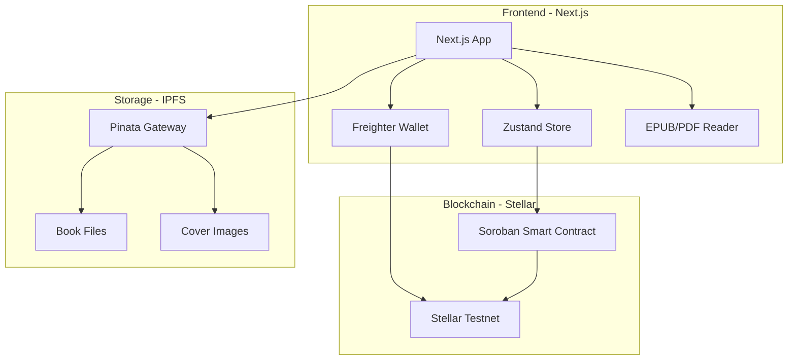
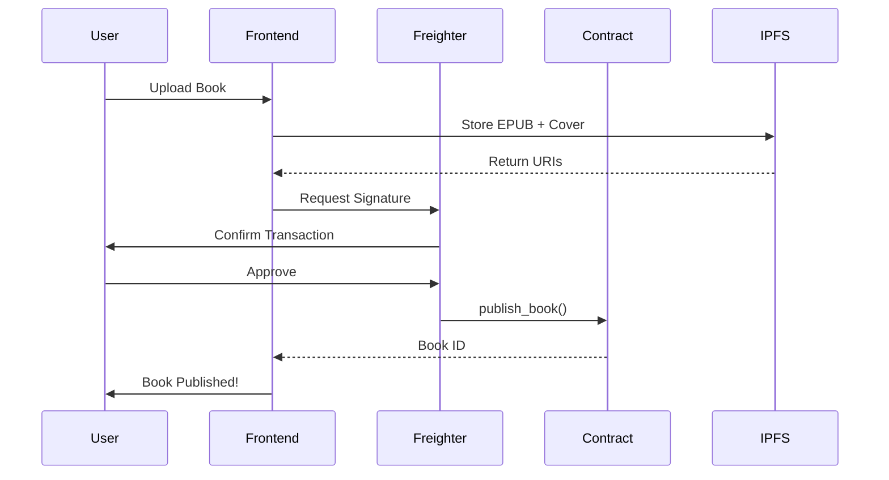

# Xandria - Decentralized Book Marketplace on Stellar

A blockchain-powered platform for authors to publish and sell digital books as NFTs, built on the Stellar blockchain using Soroban smart contracts.

## Live Demo

**Frontend:** `https://www.xandria.store/` 
**Contract Address:** `CCK3XSWGFOAH2K6OLQYFDHS2OR62TMZ3YESFAF2LDD7RS76I6CPO7GKK`  
**Network:** Stellar Testnet

---

## Table of Contents

- [Problem Statement](#-problem-statement)
- [Features](#-features)
- [Architecture Overview](#-architecture-overview)
- [Tech Stack](#-tech-stack)
- [Getting Started](#-getting-started)
- [Smart Contract](#-smart-contract)
- [Screenshots](#-screenshots)
- [Future Scope](#-future-scope)
- [Contributing](#-contributing)

---

## Problem Statement

### What We're Solving

Traditional book publishing and distribution face several challenges:

1. **High Platform Fees:** Authors lose 30-70% of revenue to publishers and platforms
2. **Limited Control:** Authors have little control over pricing, distribution, and rights
3. **Piracy & Ownership:** Digital books are easily pirated, and buyers don't truly "own" their purchases
4. **No Direct Community Support:** Readers can't directly support their favorite authors beyond purchases
5. **Centralized Control:** Platform owners can remove content or change terms arbitrarily

### How Xandria Solves It

**Xandria** leverages blockchain technology to create a **decentralized marketplace** where:

- **Authors keep 90% of revenue** (only 10% platform fee, far lower than traditional platforms)
- **True ownership via NFTs** - purchased books are owned on-chain, cannot be revoked
- **Direct tipping system** - readers can tip authors 100% directly with personalized messages
- **Immutable publishing** - once published, content cannot be censored
- **Transparent transactions** - all sales and tips are verifiable on-chain
- **Limited editions** - authors can create scarce, collectible editions

---

## Features

### For Authors

- **Publish Books as NFTs** - Upload EPUB/PDF files with cover art to IPFS
- **Set Your Price** - Full control over pricing in XLM
- **Limited Editions** - Create special editions with limited supply
- **Receive Tips** - Get direct support from readers with messages
- **View Analytics** - See all tips and messages on your book pages
- **Decentralized Storage** - Books stored on IPFS via Pinata

### For Readers

- **Browse Marketplace** - Discover books across various genres
- **Own Your Books** - Purchase books as NFTs you truly own
- **Built-in Reader** - Read EPUB and PDF files directly in the app
- **Tip Authors** - Send XLM tips with personalized messages
- **Personal Library** - Access your purchased books anytime
- **Mint Numbers** - Limited edition books show your unique mint number

### Platform Features

- **Freighter Wallet Integration** - Secure wallet connection
- **Stellar Network** - Fast, low-cost transactions
- **Dark Mode UI** - Beautiful, modern interface
- **EPUB Reader** - Full-featured reading experience with page navigation
- **Premium Design** - Glassmorphism, gradients, and smooth animations
- **Book Details** - Rich metadata including ratings, genres, and descriptions

---

## Architecture Overview

### System Architecture



### Smart Contract Flow



### Data Flow

1. **Publishing:**
   - Author uploads book file (EPUB/PDF) and cover image
   - Files uploaded to IPFS via Pinata
   - Smart contract stores metadata (title, author, price, URIs)
   - Book assigned unique ID and mint count

2. **Purchasing:**
   - Buyer browses marketplace
   - Connects Freighter wallet
   - Initiates purchase via `buy_book()`
   - Contract transfers XLM to author (90%) and admin (10%)
   - Purchase recorded on-chain
   - Buyer gets access to book URIs

3. **Tipping:**
   - Reader opens book detail page
   - Enters tip amount and message
   - Contract transfers 100% of XLM directly to author
   - Tip and message stored on-chain with timestamp
   - Author can view all tips on their book pages

---

## Tech Stack

### Frontend
- **Framework:** Next.js 16 (React 19)
- **Styling:** Tailwind CSS 4
- **State Management:** Zustand
- **Blockchain Integration:** @stellar/freighter-api
- **File Reading:** EPub.js, react-pdf
- **Animations:** Framer Motion, GSAP

### Smart Contract
- **Language:** Rust
- **SDK:** Soroban SDK v25.1.0
- **Network:** Stellar Testnet

### Storage
- **IPFS Provider:** Pinata
- **File Types:** EPUB, PDF (books), PNG/JPG (covers)

### Development Tools
- **Package Manager:** pnpm
- **TypeScript:** ^5.0
- **Stellar CLI:** For contract deployment and bindings generation

---

## Getting Started

### Prerequisites

- Node.js 18+ and pnpm
- Rust and Cargo (for smart contract development)
- Stellar CLI ([installation guide](https://developers.stellar.org/docs/tools/developer-tools))
- Freighter Wallet browser extension

### Installation

1. **Clone the Repository**
   ```bash
   git clone https://github.com/yourusername/xandria-stellar.git
   cd xandria-stellar
   ```

2. **Install Frontend Dependencies**
   ```bash
   cd xandria_frontend
   pnpm install
   ```

3. **Configure Environment Variables**
   
   Create a `.env` file in `xandria_frontend/`:
   ```env
   NEXT_PUBLIC_CONTRACT_ID=CCK3XSWGFOAH2K6OLQYFDHS2OR62TMZ3YESFAF2LDD7RS76I6CPO7GKK
   NEXT_PUBLIC_RPC_URL=https://soroban-testnet.stellar.org
   NEXT_PUBLIC_NETWORK_PASSPHRASE="Test SDF Network ; September 2015"
   NEXT_PUBLIC_PINATA_API_KEY=your_pinata_api_key
   NEXT_PUBLIC_PINATA_API_SECRET=your_pinata_secret
   NEXT_PUBLIC_PINATA_JWT=your_pinata_jwt
   ```

4. **Run the Development Server**
   ```bash
   pnpm dev
   ```
   Open [http://localhost:3000](http://localhost:3000)

### Build Smart Contract (Optional)

```bash
cd backend/soroban-hello-world
stellar contract build
```

### Deploy Smart Contract (Optional)

```bash
stellar contract deploy \
  --wasm target/wasm32v1-none/release/hello_world.wasm \
  --source alice \
  --network testnet
```

---

## Smart Contract

### Contract Address
**Testnet:** `CCK3XSWGFOAH2K6OLQYFDHS2OR62TMZ3YESFAF2LDD7RS76I6CPO7GKK`

### Key Functions

#### `publish_book`
Publish a new book NFT to the marketplace.

```rust
pub fn publish_book(
    env: Env,
    author: Address,
    title: String,
    author_name: String,
    description: String,
    price: i128,
    cover_uri: String,
    book_uri: String,
    is_special: bool,
    supply: u32,
) -> u32
```

#### `buy_book`
Purchase a book NFT.

```rust
pub fn buy_book(
    env: Env,
    buyer: Address,
    book_id: u32,
    token_address: Address,
)
```

#### `tip_author`
Send a tip with a message to an author.

```rust
pub fn tip_author(
    env: Env,
    sender: Address,
    book_id: u32,
    amount: i128,
    message: String,
    token_address: Address,
)
```

#### `get_tips`
Retrieve all tips for a book.

```rust
pub fn get_tips(env: Env, book_id: u32) -> Vec<Tip>
```

### Data Structures

**Book**
```rust
pub struct Book {
    pub author: String,
    pub author_address: Address,
    pub title: String,
    pub description: String,
    pub price: i128,
    pub cover_uri: String,
    pub book_uri: String,
    pub is_special: bool,
    pub total_supply: u32,
    pub remaining_supply: u32,
}
```

**Tip**
```rust
pub struct Tip {
    pub sender: Address,
    pub amount: i128,
    pub message: String,
    pub timestamp: u64,
}
```

---

## Screenshots

> **Note:** Add screenshots of your dApp here. Recommended screenshots:

### Homepage


### Marketplace


### Book Details


### Community


### Reading Page


### Tip Modal


### Author Dashboard


---

## Future Scope

### Short-term (Q2 2026)
-  **Mainnet Deployment** - Launch on Stellar mainnet
-  **Author Profiles** - Dedicated author pages with all their books
-  **Advanced Search** - Filter by genre, price, rating
-  **Book Reviews** - On-chain review system
-  **Wishlist Feature** - Save books for later

### Medium-term (Q3-Q4 2026)
-  **Royalty System** - Authors earn on secondary sales
-  **Book Series Support** - Bundle related books
-  **Reading Achievements** - NFT badges for reading milestones
-  **Social Features** - Follow authors, share books
-  **Mobile App** - iOS and Android native apps
-  **Multi-language Support** - Internationalization

### Long-term (2027+)
-  **DAO Governance** - Community-driven platform decisions
-  **Author Tokens** - Authors can issue their own tokens
-  **Lending Protocol** - Lend/borrow books with collateral
-  **Analytics Dashboard** - Detailed sales and reader insights
-  **AI Recommendations** - Personalized book suggestions
-  **Cross-chain Bridge** - Support for other blockchains

---

## License

This project is licensed under the MIT License - see the [LICENSE](LICENSE) file for details.

---

<div align="center">

**Made with ❤️ using Stellar blockchain**

</div>
